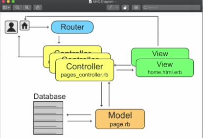

# The Complete Ruby on Rails Developer Course - Section 3 Notes

## Introduction
Most websites are web apps these days. E.g. Airbnb, Github, Twitter, Basecamp, Facebook. Pretty much all websites where you have some kind of interaction. E.g. filling out forms, clicking like buttons

Airbnb, Twitter, Shopify, Github all started with Rails. Airbnb, Shopify, Github continue to use Rails.

Inventor is @dhh

Rails is OSS. You can find all gems at rubygems.org and also lookup the code repositories on Github. e.g. if you wanted to have authentication functionality you could go to the devise repository on Github (search for devise gem).

### Rails overview:

https://guides.rubyonrails.org/

https://rubyonrails.org/

https://weblog.rubyonrails.org/

### Creator of Rails: David Heinemeier Hansson

https://dhh.dk/

### Ruby meetups:

https://www.meetup.com/topics/ruby/

### Online code repository hosting services:

https://github.com/

https://bitbucket.org/

Devise gem GitHub repository:

https://github.com/heartcombo/devise

### Gems for Ruby and Ruby on Rails:

https://rubygems.org/


## Model, View, Controller (MVC) Structure - Chpt 55
MVC = Separation of the presentation layer (what the viewer sees) and the back-end (where the business logic is carried out).

### Models
Models are resources in your app., e.g. users, articles, job posts; whatever are the resources used in your app. Most often will require persistence, so a database is needed, with subsequent tables etc. In rails you can use your model to communicate with your tables.

### Views
What is visible to the user. HTML, CSS, Javascript. E.g. Home, new, Friends, My Porfolio etc. However, since we are using embedded ruby, we will use erb templates, e.g. home.html.erb

### Controller
Controllers are also invisible to the user. They are behind the scenes and the 'brains' of your application. You will write code within the controller to dictate how user requests are handled and routed in the application. E.g. a users_controller to handle how users are managed within the app. posts_controller to manage blog posts etc.

### A Typical Folder Structure in a Rails Application
Has an "app" folder, under which are a number of folders including the 3 mainstays: controllers - models - views | layouts

#### MVC - Model, View, Controller

General flow of Rails application:

-> Request made at browser

-> Request received at router of rails application

-> Request routed to appropriate action in a controller

-> Controller#action either renders a view template or communicates with model

-> Model communicates with database

-> Model sends back information to controller

-> Controller renders view

## Installing Dependencies through AWS (and also Linux)
Create a new environment, then make sure to choose Ubuntu (not Amazon Linux).

### rvm
This environment comes with ruby 2.6.3 (2019) installed, and rvm, which is Ruby Version Manager. You can list the ruby versions installed with the command: $ rvm list rubies

You can also list which ruby versions are available with: $ rvm list known

For Linux - install rmv (and also Rails if you want) here: https://rvm.io/

### Nodejs
Next need to install nodejs. But this is already installed in AWS. Use $ node --version to find out which version you have.

### Yarn
yarnpkg.com is the place to see this.

https://yarnpkg.com/getting-started/install

To install I did:
$ sudo corepack enable
$ yarn set version stable

It seems you need to start a rails project (i.e. have a package.json) in order to run yarn, as it checks for this?

You can check yarn is installed by $ yarn --version

### Bundler
$ gem list bundler

(should be installed)

And update to latest version with $ gem update bundler

## Installing Rails version 6
$ gem list rails >will list the rails versions already installed.
To get the latest version:  $ sudo gem install rails

To get previous versions: $ sudo gem install rails -v 6.0 (etc.)

$ rails -v > this will show the default version

To uninstall a specific version of rails: $ sudo gem uninstall rails -v '6.0.0'

Sometimes you need to uninstall railties if the version is still listed after install. See here https://www.aloucaslabs.com/miniposts/how-to-uninstall-a-specific-version-of-rails-from-your-development-machine


### Creating a New Rails App
$ rails new [name_of_app] >> This will create a new app in the location, using the default rails version. Make sure there are no spaces in the name.

### Check it
From the directory, in the terminal, start the server with type $ rails server or $ rails s

Then hit "Preview" in top right, and select Preview Running Application

In Linux (not AWS) the message in terminal after starting the Rails server will tell you the IP address in which to view the App. In my system this was 127.0.0.1:3000

### Problem with Railties
I was getting some error with trying to install a new Rails app, something about the version of Ruby and railsties, so I installed using Rails 6 instead of 7:
$  rails _6.1.6_ new appname

## Chpt 58 Root, Route, controller, more MVC and say Hello World
To change the current homepage we first go to: config >> routes.rb

Between the do & end, type 'root' and then need to specify where to send it to. E.g.:
```ruby
  do
    root '(where to send it)'
  end
  ```

We want to send it to a controller, so we find this in the app >> controller folder. There is only one controller there, so simply write that controller in:
```ruby
root 'application' #(no need to write application_controller as this is expected by rails)
```
Next, we want a method within the application_conroller to handle this request.

The way to specify a method is to place it after a # in the ```routes.rb``` file. I.e.:
```ruby
root 'application#hello'
```

This is telling Rails to expect a hello method (or 'action' as it is also known in Rails) in the application_controller.rb file

```ruby
  def hello
  end
```

Now, we can define a template directly here e.g. render html: 'Hello World!' which will display Hello World! when we refresh the browser (localhost:3000). However, this is not the way that we want to code. Rails wants us to utilize the "layout" file, which is in the views/layouts folder. If you look there, there is an application.html.erb file.

### Conventional Expectations in Rails
1. Define a route that points to a controller#action
2. have an appropriately named controller, for example: if dealing with layouts or static pages of teh application, a name could be pages_controller.
3. Have an appropriately named action, for example: if dealing with a homepage, the action/method could be named home.
4. If done this way, under views, rails will expect a pages folder (named for the pages controller) and a home.html.erb template (named for the home action).

So, instead of having ```root 'application#hello' ```, we should have: ```root 'pages#home' ```in the routes.rb file.

Now we need to create a pages controller and define a home method (or action). We do this from the terminal. If the server is running then just open up a new terminal tab (maybe cntrl t?).

```sh
rails generate controller pages
```
After this is generated we go to the pages controller:
```ruby
class PagesController < ApplicationController
  def home #this will expect a home.html.erb file under the pages folder.
  end
end
```
Note: I was getting some application error (it was still looking for the hello method) until I closed all files (which forced them to save) and then restarted. Unfortunately on restart I got the following error:

Webpacker::Manifest::MissingEntryError in Pages#home

After lots of searching and reading about this error I [tried](https://github.com/rails/webpacker/issues/2992): ``` rails webpacker:install ``` and it worked! I got the "Hello World!" screen.

In summary, the relationship between Model, Controller and Views are:



## Chpt 60 Structure of a Rails Application

More details of what each folder and file do can be found on the Ruby On Rails website [here](https://guides.rubyonrails.org/getting_started.html#creating-the-blog-application).

### app folder
Assets >> Where we store static assets such as images, videos, style sheets. Images that we may use in the layout of the application (not user uploaded images).

The application.css stylesheets enable the style sheets to be shared with all the views in the application.

The channels folder enables real-time communication for the app (e.g. a chat function).

Controllers folder houses all our controllers. the ApplicationController inherits all the functions of the ActionController, and any controllers we create inherit the functionality of the ApplicationController.

 Helpers folder will hold helper functions/methods that we'll write and use in our view templates.

 Javascript folder (previously in Assets folder), has a 'packs' folder which has an application.js file which makes javascript available for our application.

 Models folder - we store all our models. All models we create will inherit the ApplicationRecord function.

 Next is Views folder which has all our views, which get served through here. All the views (html) files we create are served through the <%=yield> tag in the application.html.erb file.

 Most of the work in this course is done in this app folder.

### bin folders
Not much to note here

### config folders
Within here we have the environments that define the different configurations we need for each environment.

Api keys, credentials. Most important file right now for us is the routes.rb file.

### db folders
where we have our development and test databases are housed. We use Sqlite - which is default for rails. We will save data from our applications within tables.

We create tables using migration files - which will be here. Also has schema files, which has a list of all our tables, an easy to read structure of our table, etc.

### Gemfile
This file is in the root folder, and lists all gems we have. If we want to add or remove any, we can update this file.
The Gemfile.lock file shows the dependencies for each gem.

### Package.json
This is used to list the versions and dependencies which we add to our application using Yarn.

### README.md
Generally this file displays in the code repository for the application.

## Chpt 61 Version Control with Git
Track changes start as soon as we turn it on. It tracks the files and folders, starting with an initial state.

When we make changes to our code and are happy with it, we "commit" it to Git. We can include a message with the commit (save).

A commit copies and saves your code at the time of the commit. So we then have previous versions (saves) of our code.

[Git](git-scm.com) is a very common version control system.

You can start tracking with git simply by adding an account in your terminal. See [here](https://training.github.com/downloads/github-git-cheat-sheet/) for details.

You need to be in the app directory when you start a new git commit. You can ignore files by adding them to the .gitignore file (it's a hidden file in the directory).

When commiting, put a useful message, in present tense.

There are some commands to remember if just using git from the CLI. If using git this way, refer to the cheat sheet I linked above.

### Pushing Commits to Github via SSH
Mushrur shows how he pushes commits to his github account (basically this is backing up your saves to the cloud). After setting up your github account and creating a new repository with the same name as your project folder on your local machine, you need to set up SSH.

First you need to create an SSH certificate on your local computer. Github has really great guides to walk you through this process. Mushrur takes you to other sites explaining what an SSH certificate is and how to generate one, but after going through all of it I recommend just following the guide at Github as it is way less confusing IMO.

Start here: [Check for existing SSH key](https://docs.github.com/en/authentication/connecting-to-github-with-ssh/checking-for-existing-ssh-keys)

Basically work through the list that is on the left of the link above regarding "Connect with SSH".

[Generate a new SSH key](https://docs.github.com/en/authentication/connecting-to-github-with-ssh/generating-a-new-ssh-key-and-adding-it-to-the-ssh-agent), [Add that new SSH key to your Github account](https://docs.github.com/en/authentication/connecting-to-github-with-ssh/adding-a-new-ssh-key-to-your-github-account), then [Test your SSH connection](https://docs.github.com/en/authentication/connecting-to-github-with-ssh/testing-your-ssh-connection).

Once you've set up your SSH key and linked it to your Github account, while in your project folder on your local machine you can push the commit to your github account with ``` git push -u origin main```

Now, when I did that I was asked for my Github username and then password. If I provided them then I'd get this error:

```
remote: Support for password authentication was removed on August 13, 2021. Please use a personal access token instead.
remote: Please see https://github.blog/2020-12-15-token-authentication-requirements-for-git-operations/ for more information.
fatal: Authentication failed for 'https://github.com/rj-wtf/test_app.git/'
```
The system should not have been asking for my username and password. It should have been asking for my SSH password.

After a lot of searching I discovered that somehow on my local machine my SSH-Agent was not working (it appears that this loads your SSH certificate and remembers it). I tried the advice [here](https://www.codegrepper.com/code-examples/shell/git+not+working+with+ssh%5C) for "git not using ssh key", which is:

```ssh -T git@github.com```  
```git remote set-url origin git@github.com:username/repo.git```
(put your username and the name of your repository where it says username/repo).

It worked! Now when doing ```git push -u origin main``` it pushed my local commit to my github account.

#### Pushing Updates to Git/GitHub
To commit changes to git (on local machine) use:
```git add -A``` this will add all files (including new ones) to the repository.

```git commit -m "Write here the summary about what this change entails"```

Now your local machine git will be up-to-date. However, your remote (cloud) git on Github will not be up-to-date yet. If you type ```git status```:

```On branch main```   
```Your branch is ahead of 'origin/main' by 1 commit.```  
```(use "git push" to publish your local commits)```  

This means your online git (origin is the online repository, master is the master branch) does not yet have the changes. Push the changes to the cloud with:

```git push origin main```  
You may need to enter your SSH password.
## Chpt 66 Front-end: Learn and practice HTML and CSS References
HTML basics: https://developer.mozilla.org/en-US/docs/Learn/Getting_started_with_the_web/HTML_basics

CSS basics: https://developer.mozilla.org/en-US/docs/Learn/Getting_started_with_the_web/CSS_basics

HTML tables: https://developer.mozilla.org/en-US/docs/Learn/HTML/Tables

HTML forms: https://developer.mozilla.org/en-US/docs/Learn/Forms/Your_first_form

Alternate resource to learn HTML and CSS together while building a website: https://learn.shayhowe.com/html-css/
## Chpt 68 Add About Pg and Homework Assignment
With the ROR running, going to a localhost:3000/about page returns the error:
```ActionController::RoutingError (No route matches [GET] "/about")```

This gives information on what is needed, i.e. some kind of GET statement in the routes file. So in the routes.rb file under the root statement we add:
```ruby
get 'about'
```
Then we specify where to send this 'about' to. Since it is just a static html page, we can use our pages controller.
```ruby
get 'about', to: 'pages#about'
```
pages is our controller and about is the action (or method).

Adding it to our controller pages is simply:
```ruby
class PagesController < ApplicationController
  def home
  end

  def about
  end
end
```
### Adjusting VS Code
~~Where Mashrur edits the settings.json file within Settings >> Search: Emmet >> Emmet: Include Languages; since there is no .json file anymore and seems to have been replaced by two fields to enter key and value, I entered the first key:value pair as "*.erb" and "html", and the second as "ruby" and "html".~~ And - didn't work.  


